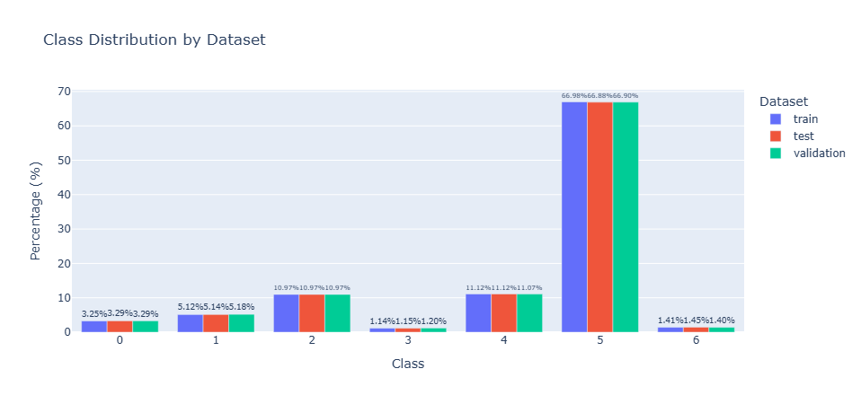
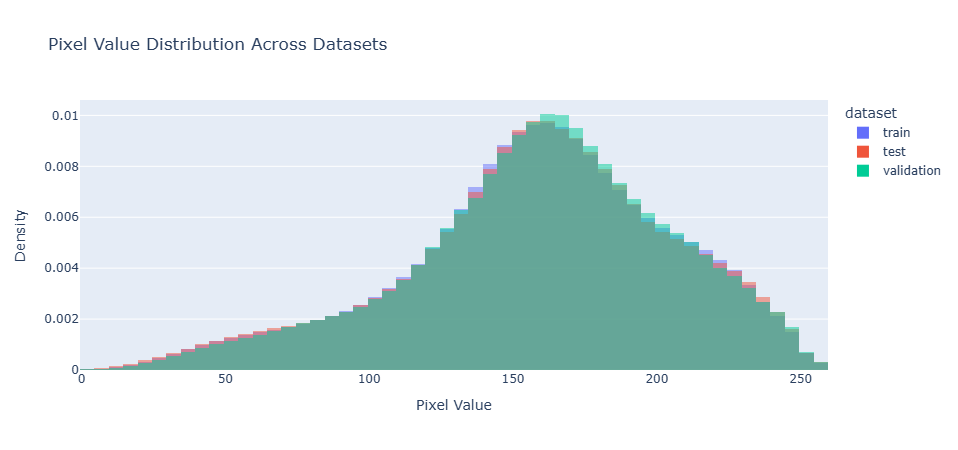
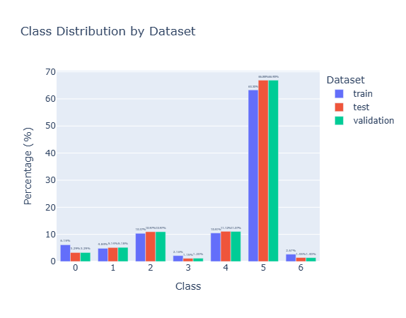
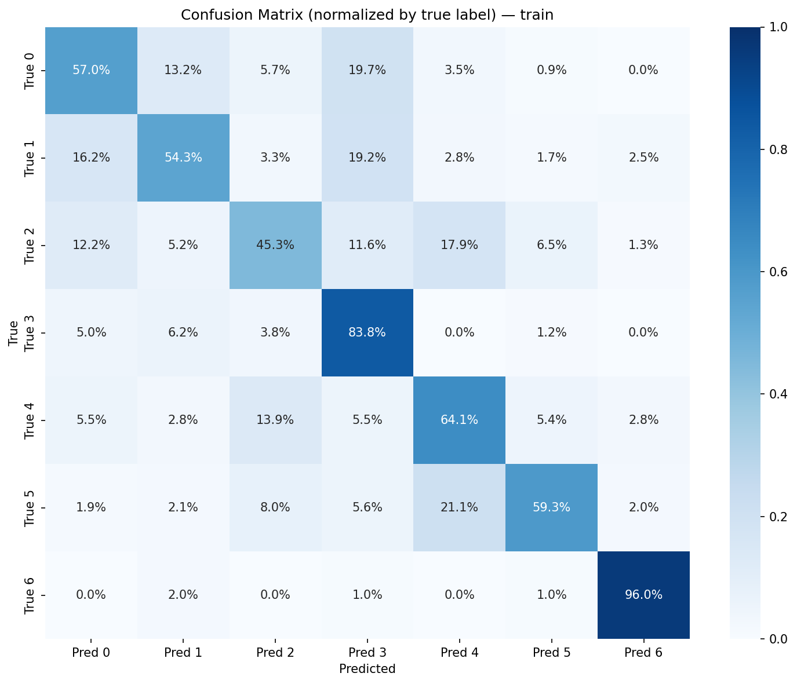
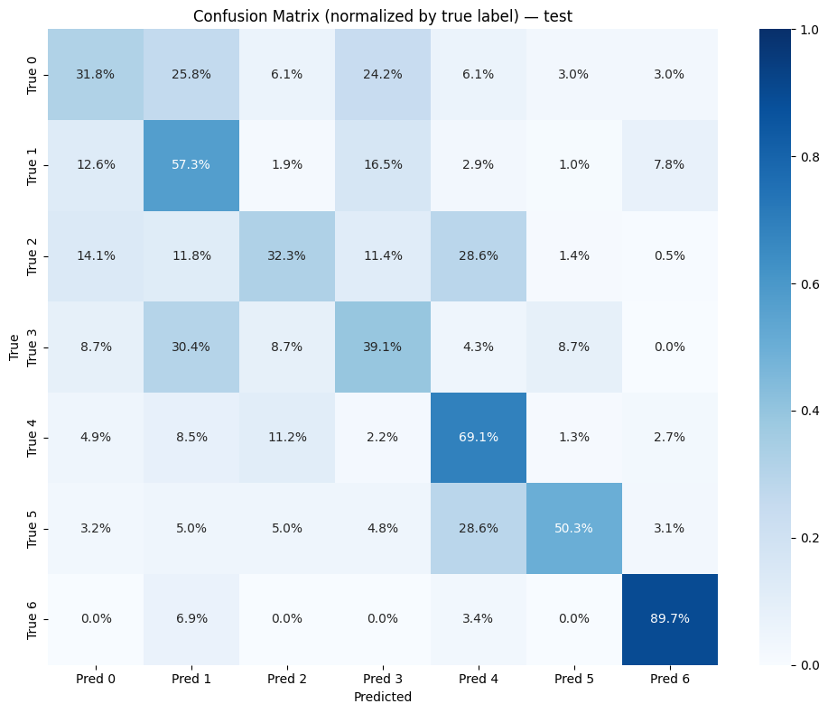
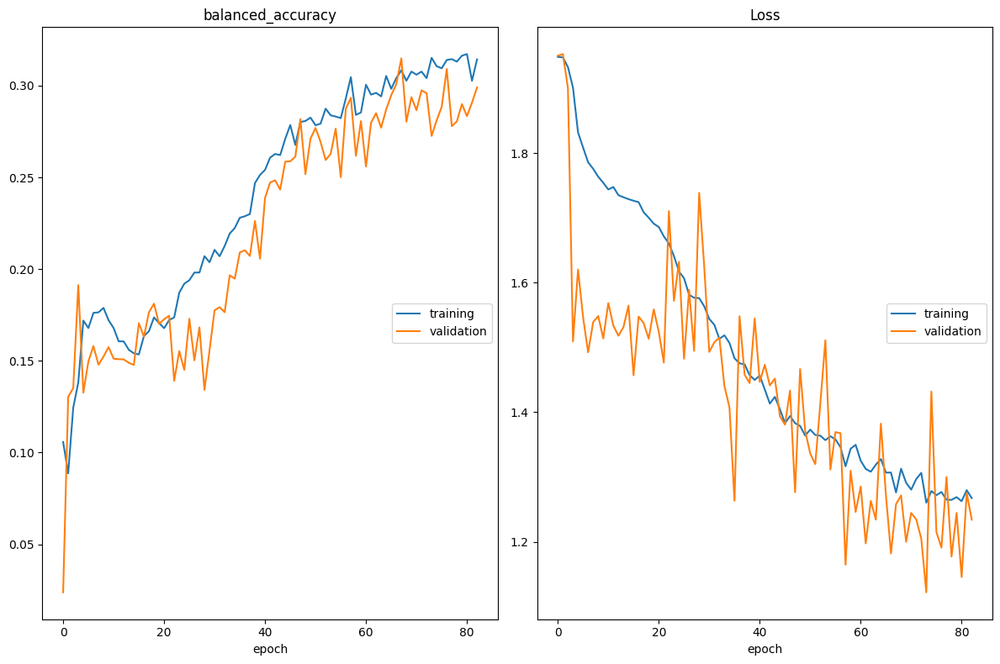
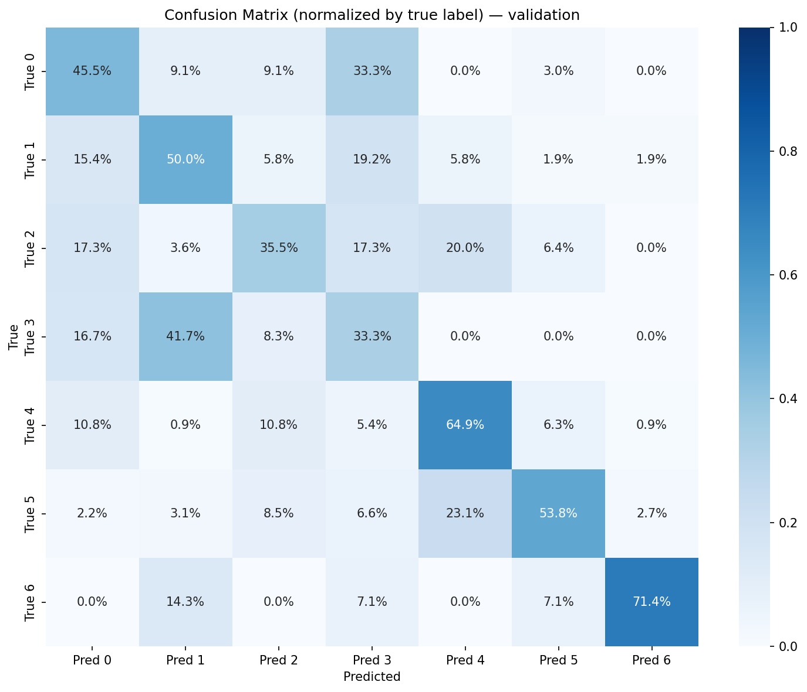

# Caso de Estudio 01 — Detección Multiclase de Lesiones Cutáneas con CNN

**Curso:** Aprendizaje Profundo · 32310019 · 2026-01  
**Dataset:** DermaMNIST (basado en HAM10000)  
**Framework:** TensorFlow 2.21 / Keras

---

## Contexto

El cáncer de piel es uno de los tipos de cáncer más comunes a nivel mundial. Con el auge del *Computer-Aided Diagnosis* (CAD), este proyecto diseña, entrena y evalúa una arquitectura CNN capaz de clasificar imágenes dermatológicas en 7 categorías clínicas usando el dataset **DermaMNIST** de 28×28 píxeles RGB.

---

## Estructura del repositorio

```
Taller_01/
├── main.ipynb                  # Notebook principal — pipeline completo
├── predict.py                  # Pipeline de inferencia reutilizable
├── requeriments.txt            # Dependencias del proyecto
├── data/
│   └── data.npz                # Dataset DermaMNIST (descargado localmente)
├── models/
│   └── dermClass.keras         # Modelo entrenado (mejor epoch por ModelCheckpoint)
├── figures/
│   ├── conf_matrix_train.png   # Matriz de confusión — split train
│   ├── conf_matrix_val.png     # Matriz de confusión — split val
│   ├── conf_matrix_test.png    # Matriz de confusión — split test
│   └── train_loss.png          # Curvas de loss y balanced accuracy
└── src/
    ├── __init__.py
    ├── data_loader.py          # Carga y descarga del dataset
    ├── EDA.py                  # Funciones de análisis exploratorio
    ├── training.py             # Clase skin_classifier, balanced_accuracy, augmentation
    └── utils/
        ├── __init__.py
        ├── scaler.py           # Normalización de píxeles
        └── convolutional.json  # Configuración de la arquitectura CNN
```

---

## Clases del dataset

| Índice | Código | Descripción |
|:------:|--------|-------------|
| 0 | `akiec` | Queratosis actínica / Carcinoma intraepitelial (Bowen) |
| 1 | `bcc` | Carcinoma de células basales |
| 2 | `bkl` | Lesiones benignas tipo queratosis |
| 3 | `df` | Dermatofibroma |
| 4 | `nv` | Nevus melanocíticos — clase dominante (~67% del train) |
| 5 | `mel` | Melanoma — lesión maligna de alta prioridad ⚠ |
| 6 | `vasc` | Lesiones vasculares |

---

## Instalación

```bash
pip install -r requeriments.txt
```

Dependencias principales: `tensorflow==2.21.0`, `scikit-learn==1.8.0`, `plotly`, `livelossplot`, `pydot`, `graphviz`.

---

## Reproducibilidad

La semilla global se fija al inicio del notebook antes de cualquier operación:

```python
import os, random, numpy as np, tensorflow as tf

SEED = 161105
os.environ["PYTHONHASHSEED"]      = str(SEED)
os.environ["TF_DETERMINISTIC_OPS"] = "1"   # operaciones deterministas en GPU
random.seed(SEED)
np.random.seed(SEED)
tf.random.set_seed(SEED)
```

`TF_DETERMINISTIC_OPS=1` fuerza kernels CUDA deterministas, eliminando la variación entre ejecuciones en GPU.

---

## Pipeline del notebook (`main.ipynb`)

### 1. Carga de datos

```python
from src import data_loader as dl
X, Y = dl.load_data(fetch=False)   # fetch=True descarga desde Zenodo
```

`X` y `Y` son diccionarios con claves `"train"`, `"val"` y `"test"`. Los datos se tomaron del repositorio [DermaMNIST](https://zenodo.org/record/4269852/files/dermamnist.npz?download=1), los cuales se encontraban separados en los tres conjuntos de entrenamientos.

### 2. Preprocesamiento — escalado de píxeles

```python
from src.utils.scaler import apply_scaler
X = apply_scaler(X)   # divide entre 255 → rango [0, 1]
```

Escalar a [0, 1] mejora el condicionamiento numérico del optimizador: los gradientes y activaciones se mantienen en rangos estables, favoreciendo la convergencia de Adam, dado que los valores de pixeles entre 0 y 255 implican menor variación porcentual a la hora de dar un paso con el optimizador.

### 3. Análisis exploratorio (EDA)

```python
from src import EDA
EDA.pixels_report(X)          # distribución de valores de píxel por split
EDA.labels_report(Y)          # distribución de clases (%) por split
EDA.imbalance_report(Y)       # ratio de desbalance, clases minoritarias y raras
```

El análisis confirma el predominio de `nv` con ~67% del conjunto de entrenamiento, lo que exige una estrategia explícita de compensación.


Se evidencia el desbalance con los resultados de `imbalance_report`

| Idx | Código  | count | percentage | ratio_vs_max | is_minority | is_rare |
|:---:|---------|------:|-----------:|-------------:|:-----------:|:-------:|
| 0   | `akiec` |   228 |       3.25 |        0.049 | ✓           | ✓       |
| 1   | `bcc`   |   359 |       5.12 |        0.076 | ✓           | ✓       |
| 2   | `bkl`   |   769 |      10.97 |        0.164 | ✓           |         |
| 3   | `df`    |    80 |       1.14 |        0.017 | ✓           | ✓       |
| 4   | `nv`    |   779 |      11.12 |        0.166 | ✓           |         |
| 5   | `mel`   |  4693 |      66.98 |        1.000 |             |         |
| 6   | `vasc`  |    99 |       1.41 |        0.021 | ✓           | ✓       |

En cuanto a las imágenes, se nota una distribución similar de la magnitud de los pixeles en los 3 conjuntos, con distribución sesgada a la derecha. Se podría complementar el análisis revisando la intensidad de los pixeles en los canales RGB por separado.




### 4. Manejo del desbalance

Se combinan dos estrategias complementarias:

**a) Augmentation de las 3 clases más minoritarias** (`df`, `vasc`, `akiec`):

```python
from src.training import augment_minority_classes
X_aug, Y_aug = augment_minority_classes(X, Y, key="train", n_minority=3)
# Flips aplicados: horizontal (df), vertical (vasc), ambos/180° (akiec)
```

**b) Class weights inversamente proporcionales a la frecuencia:**

```python
from src.training import compute_class_weights
class_weights = compute_class_weights(Y_aug, key="train")
# Integrados en model.fit(..., class_weight=class_weights)
```

Esta combinación penaliza más los errores en clases minoritarias sin modificar el conjunto de validación ni de test.



**c) Métricas normalizadas:**

Se crea una función personalizada `balanced_accuracy`, donde las métricas van normalizadas por la cantidad de registros reales de las etiquetas a clasificar. 

Esto hace que, al tener un conjunto desbalanceado, el `accuracy` no este influenciado por las clase predominentes, y la mala clasificación de las clases minoritarias penalicen fuertemente a la métrica, forzando mejorar los hiperparámetros.

Esto es relevante, ya que aun con las operaciónes de `augmentation`, el conjunto se muestra fuertamente desbalanceado.

### 5. Arquitectura CNN

La arquitectura es configurable mediante `src/utils/convolutional.json`:

```
Input (28×28×3)
│
├── Conv2D  32 filtros 5×5 · ReLU · same padding
│   ├── BatchNormalization
│   └── Dropout 0.1
│
├── Conv2D  64 filtros 3×3 · ReLU · same padding
│   ├── BatchNormalization
│   ├── MaxPooling2D 2×2  →  14×14×64
│   └── Dropout 0.2
│
├── GlobalAveragePooling2D  →  1×1×64
│
├── Dense 64 · ReLU · Dropout 0.3
├── Dense 32 · ReLU · Dropout 0.2
└── Dense 7  · Softmax  →  probabilidades por clase
```

**Decisiones de diseño:**

- **Kernel 5×5 en la primera capa:** para imágenes de 28×28, un kernel más amplio captura contexto espacial más rico desde el inicio (receptive field ~5×5 vs. 3×3).
- **Un solo MaxPooling:** dos poolings consecutivos colapsan la resolución de 28×28 a 7×7 de forma demasiado agresiva.
- **BatchNormalization:** estabiliza activaciones entre capas, acelera convergencia y actúa como regularizador suave — especialmente útil con datasets pequeños.
- **GlobalAveragePooling2D:** reduce el mapa de características a un vector de 64 valores, evitando sobreparametrización antes del clasificador.
- **Softmax:** convierte los logits en un vector de probabilidades que suma 1, requerido para clasificación multiclase excluyente. Se combina con `SparseCategoricalCrossentropy`, equivalente a maximizar la verosimilitud sobre etiquetas enteras.

### 6. Entrenamiento

```python
model.fit(
    X_aug, Y_aug,
    train_tag       = "train",
    validation_tag  = "test",
    epochs          = 100,
    batch_size      = 16,
    learning_rate   = 1e-3,
    use_live_loss   = True
)
```

**Callbacks configurados:**

| Callback | Parámetros clave |
|----------|-----------------|
| `EarlyStopping` | `monitor=val_balanced_accuracy`, `patience=15`, `mode=max`, `start_from_epoch=40` |
| `ModelCheckpoint` | `monitor=val_balanced_accuracy`, `save_best_only=True` |

**Métrica de entrenamiento — `balanced_accuracy`:**  
Como se mencionó previamente, se usó una variación en el cálculo de las métricas de clasfificación.. A diferencia de la accuracy estándar, no se sesga por la clase dominante `nv`. Un modelo que predijera siempre `nv` obtendría ~0% de balanced accuracy en las clases restantes.

```python
# Fórmula implementada en src/training.py
conf    = confusion_matrix(y_true, y_pred, num_classes=n)
recalls = diag(conf) / row_sums(conf)
balanced_accuracy = mean(recalls)
```

### 7. Evaluación

```python
model.metrics_report(X, Y)
```

Genera para cada split (train / val / test):
- Matriz de confusión **normalizada por etiquetas reales** (row-wise): cada celda muestra el porcentaje del total de muestras verdaderas de esa clase, equivalente al recall por clase. Escala fija [0, 1] para comparabilidad entre splits.
- `classification_report` con precisión, recall y F1 por clase.

---

## Inferencia con el modelo entrenado

### Desde el notebook

```python
from predict import SkinClassifierPipeline

pipeline = SkinClassifierPipeline(
    model_path = "./models/dermClass.keras",
    threshold  = 0.6
)

# Imagen individual (ruta o numpy array)
result = pipeline.predict("ruta/imagen.png")

# Array completo compatible con data_loader
results = pipeline.predict_from_array(X["test"])
```

### Desde terminal

```bash
python predict.py --image ruta/imagen.png
python predict.py --image ruta/imagen.png --threshold 0.7 --json
```

### Preprocesamiento requerido

| Parámetro | Valor |
|-----------|-------|
| Formato | RGB |
| Resolución | 28 × 28 píxeles |
| Tipo de dato | `float32` |
| Normalización | dividir entre 255 → valores en [0, 1] |
| Forma para inferencia | `(batch_size, 28, 28, 3)` |

### Interpretación de la salida

El modelo devuelve un vector softmax de longitud 7. La clase predicha es `argmax` de ese vector:

```python
{0: "akiec", 1: "bcc", 2: "bkl", 3: "df", 4: "nv", 5: "mel", 6: "vasc"}
```

### Umbral clínico recomendado

| Confianza | Acción recomendada |
|-----------|-------------------|
| ≥ 0.70 (clase estándar) | Diagnóstico automático de apoyo |
| ≥ 0.80 (clase de alto riesgo: `mel`, `bcc`, `akiec`) | Diagnóstico automático de apoyo |
| < umbral | Derivar a revisión por dermatólogo |

> ⚠ **Aviso clínico:** este modelo es un prototipo académico de apoyo al triaje. No reemplaza el diagnóstico médico especializado. En detección de cáncer, se prioriza **sensibilidad** (minimizar falsos negativos) sobre especificidad, ya que omitir un melanoma real tiene consecuencias clínicas mucho más graves que una revisión adicional innecesaria.

---

## Justificaciones técnicas para el informe

### ¿Cómo reduce la carga de trabajo del dermatólogo?

Una CNN actúa como filtro preliminar de triaje: prioriza casos sospechosos para revisión urgente, reduce la carga de revisión manual de lesiones benignas evidentes y organiza el flujo clínico. El modelo no reemplaza al especialista, sino que optimiza su tiempo.

### ¿Por qué 28×28 y no alta resolución?

| Aspecto | 28×28 | Alta resolución |
|---------|-------|-----------------|
| Costo computacional | Bajo | Alto |
| Velocidad de entrenamiento | Rápida | Lenta |
| Detalle diagnóstico | Limitado | Rico |
| Aplicabilidad clínica real | Benchmark / prototipo | Preferible |

### ¿Por qué escalar píxeles a [0, 1]?

Los píxeles sin escalar (0–255) generan gradientes de magnitudes muy distintas entre capas. Al normalizar a [0, 1], las activaciones y sus derivadas se mantienen en rangos estables, el optimizador Adam converge más rápido y se reduce el riesgo de gradientes explosivos o evanescentes.

### Estrategia frente al predominio de nv

Se evidencia que en este tipo de problema, con clases tan poco representadas como las 0, 1 y 2, no es suficiente con un oversampling, y usar el balanceo en las métricas con los pesos de las clases o la matriz normalizada llevan a un mejor aprendizaje del modelo, sin caer en el sesgos de evaluarlo por su desempeño en la clase predominante únicamente.


### Adam vs. Whale Optimization Algorithm (WOA)

Adam aprovecha el gradiente de la función de pérdida para actualizar pesos de forma eficiente y adaptativa. WOA es un algoritmo metaheurístico de optimización global que no requiere gradientes, pero escala mal con el número de parámetros (millones en una CNN). Para este problema, Adam es significativamente más eficiente y estable.

 
### ¿Por qué Softmax? Y relación con categorical crossentropy
Como explicamos en la sección de diseño, porque las 7 clases son mutuamente excluyentes y necesitamos una distribución de probabilidad sobre ellas.
 
Softmax produce probabilidades normalizadas y categorical crossentropy mide qué tan lejos está esa distribución respecto de la verdadera.

### Sensibilidad vs. Especificidad en detección de cáncer

- **Falso Negativo (FN):** el modelo no detecta una lesión maligna real → el paciente no recibe atención oportuna → consecuencia clínica grave.
- **Falso Positivo (FP):** el modelo marca una lesión benigna como sospechosa → revisión adicional innecesaria → consecuencia clínica menor.

En este contexto se prioriza **maximizar sensibilidad** (recall) en clases malignas (`mel`, `bcc`, `akiec`), aceptando un nivel mayor de falsos positivos.

---

## Resultados esperados

Las matrices de confusión normalizadas en `figures/` permiten identificar visualmente qué clases presentan mayor confusión. Se espera que `mel` y `nv` sean el par con mayor confusión mutua, dado que ambas comparten patrones pigmentados que a 28×28 píxeles pierden el detalle fino de bordes, estructura y distribución del color que distinguiría una del otro.

Como se puede ver en la matriz de confusión del entrenamiento, las clase 4 (mNevus melanocíticos ) y 5 (melanoma), mostrando que un 21% de los casos de melanoma no podian diferenciarse de una condición benigna. 




Esta distribución se replica en la evaluación del modelo, donde también notamos la buena clasifacación de las clase 6 (Lesiones vasculares) y como las clase minoritarias 0, 1 y 2 no se logran diferenciar de la clase 3 adecuadamente, dando como resultado etiquetas como 3 a las claes 0,1 y 2 entre un 15% y 25% de los casos.



El comporamiento del `accuracy` y la función de pérdida (`loss`) no muestra señales de sobreajuste. 

En `accuracy` tenemos convergencia con training llegando a ~0.32 y validation a ~0.30. La brecha entre ellas es pequeña y estable.

En `loss` Ambas curvas descienden de ~1.9 a ~1.3, convergiendo hacia el final. Training y validation terminan prácticamente superpuestas  El modelo generaliza bien.



La volatilidad puede deberse a que la distribución de las clases es ligeramente diferente.


Finalmente, en la valicación, notamos que las métricas caen un poco más, y el promedio general disminuye por las dificultades en diferencias las clases 0,1 y 2 de las clase 3. Los resultados se pueden interpretar como: Las herramienta logra detectar una parte importante de los casos malignos, pero aún hay varios que son clasificados como benignos que requieren una revisión por parte del experto.


---
